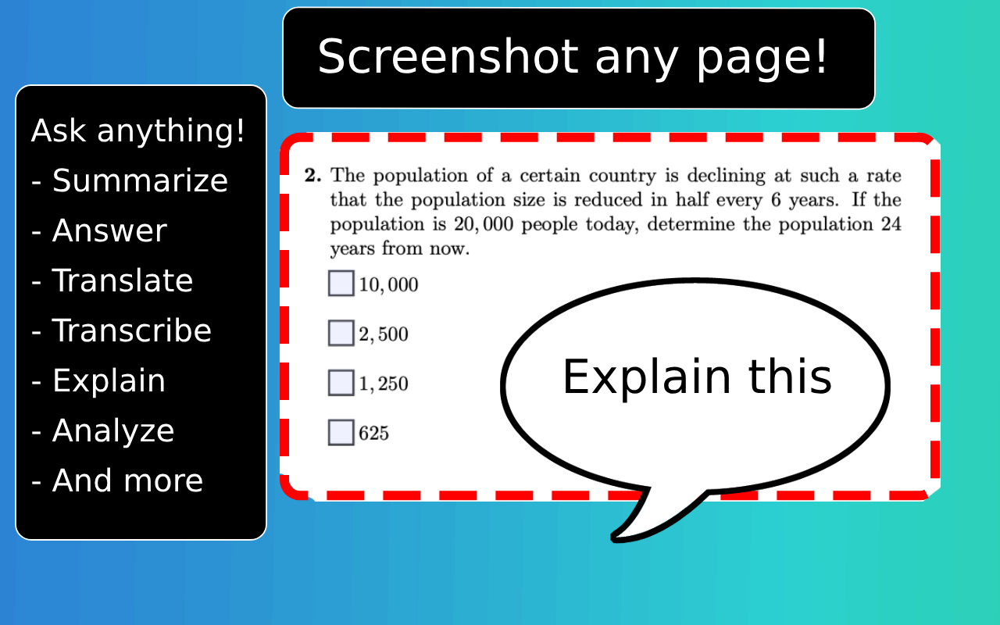

# Ask Screenshot - Issue Tracker

For ChatGPT:  [Edge](https://microsoftedge.microsoft.com/addons/detail/ask-screenshot-for-chatgp/ffhekobogobkggjnkpgcnfkgpaljopae), [Chrome](https://chromewebstore.google.com/detail/ask-screenshot-for-chatgp/jkghfpjmliifaghcjcnjpgbmfnbcpnac), or [Firefox](https://addons.mozilla.org/firefox/addon/ask-screenshot-for-chatgpt).

For Claude:  [Edge](https://microsoftedge.microsoft.com/addons/detail/ask-screenshot-for-claude/lpdgiljagdneohekllnflblemblamhfj), [Chrome](https://chromewebstore.google.com/detail/ask-screenshot-for-claude/ebmfbghckgagobmhocmjjcpbgcdfcckf), or [Firefox](https://addons.mozilla.org/firefox/addon/ask-screenshot-for-claude/).

For Gemini:  [Edge](https://microsoftedge.microsoft.com/addons/detail/ask-screenshot-for-gemini/lefcfideebpfjmnkebpifoakhnoabgkn), [Chrome](https://chromewebstore.google.com/detail/ask-screenshot-for-gemini/jekbndjaglmlbjijmnnjofggjaifajmm), or [Firefox](https://addons.mozilla.org/firefox/addon/ask-screenshot-for-gemini).

<video src="./demoGpt.mov">